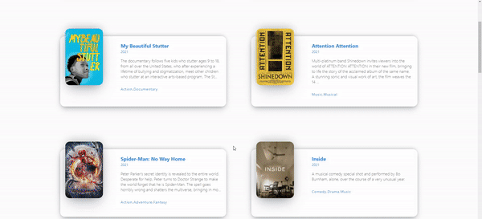

# react-movie-service

##### It is a movie service that provides information on various movies.

- 평점 8점 이상의 영화 API 받아와서 영화 정보 관련 소개
- 페이지 Route
- PropType로 데이터 검사
- Grid 사용
- 반응형 웹

## 🛠 Tech Stack

 

## 🗂 Structure

```bash
src
├── conponents
│   ├── Elements.js
│   ├── Elements.module.css
│   ├── Movie.js
│   └── Movie.module.css
├── routes
│   ├── Detail.js
│   ├── Detail.module.css
│   ├── Home.js
│   └── Home.module.css
├── App.js
├── index.js
└── styles.css
```

## API

https://yts.mx/api/v2/list_movies.json?minimum_rating=8.5&sort_by=year

## 👀



## https://kimkyungmin123.github.io/react-movie-service/
